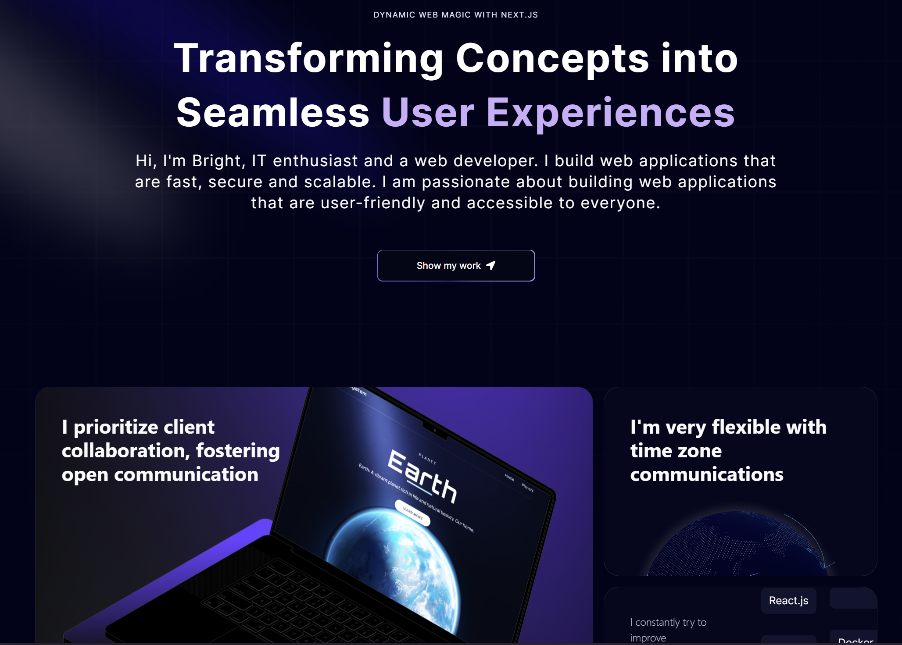

# What I Have Learned from Building this Project ?

Working on this project, a modern web application built with Next.js, React, and Tailwind CSS, Sentry, Framer Motion and Aceternity UI has been an enriching learning experience. This project has provided valuable insights into contemporary web development practices and tools.

## Key Learnings

Building 3_resume has deepened my understanding of Next.js. I explored the benefits of using Next.js for server-side rendering (SSR), which improved the performance and SEO of the application.

I mastered React, learning to efficiently create and manage components, and using hooks for state management and side effects. Integrating Tailwind CSS allowed me to style components with utility classes, resulting in a streamlined and responsive design. 

Additionally, I gained experience with Sentry for error tracking, which is crucial for monitoring and maintaining the application's stability.


Best regards,
JS MATERY on YouTube
---

## Getting Started

To get started with the project, clone the repository and install the dependencies:

```bash
git clone https://github.com/danssou/3_resume.git
cd 3_resume
npm install
```


